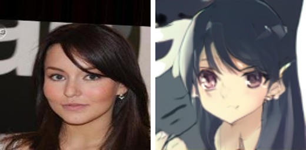
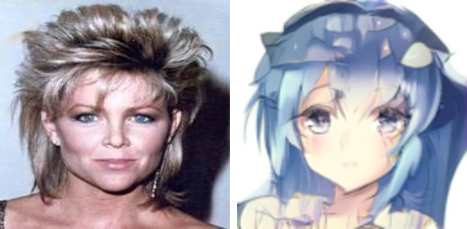

<div align="center">

# KaoAnime — selfie-to-anime style transfer

_Unpaired selfie → anime style transfer with Neural Optimal Transport._


</div>

KaoAnime turns a real face photo into an anime-style portrait via neural
image-to-image translation between two unpaired domains. The main model is
**Neural Optimal Transport (NOT)**
([Korotin et al., ICLR 2023](https://arxiv.org/abs/2201.12220)); a **CycleGAN**
([Zhu et al., ICCV 2017](https://arxiv.org/abs/1703.10593)) alternative that shares
the same building blocks is also available.

## Project overview

### Task

There are two sets of face images with no paired correspondence: domain **A** —
real photos (CelebA), domain **B** — anime faces (safebooru). The goal is to learn
a mapping `T: A → B` that transfers a photo into anime style while preserving face
geometry and identity (unpaired image-to-image translation).

### Data

- **CelebA** — a public face dataset (~200k images). The aligned `img_align_celeba`
  version is used; domain A is additionally filtered to women only via
  `list_attr_celeba.csv`.
- **AlignedAnimeFaces (safebooru)** — ~500k pre-aligned anime faces.
- Both domains are normalized to a `128×128` square: real faces by landmark
  alignment (MediaPipe), anime faces by a center crop. Each domain has a held-out
  test split.

Data is versioned with **DVC** and never stored in git. A small **demo subset**
(~800 MB, 3000/3000 train + 500/500 test) is downloaded automatically for quick
checks; the full dataset (~100 GB) is fetched from open sources on demand
(see [Data](#data-1)).

### Method

NOT (strong OT) trains two networks: a transport map `T` (UNet) that moves A to B,
and a Kantorovich potential `f` (a ResNet without BatchNorm) that tells them apart.

```
T_loss = MSE(X, T(X)) − f(T(X))      # t_iters T-steps per one f-step
f_loss = f(T(X))      − f(Y)
```

The `MSE(X, T(X))` term penalizes large pixel changes, so the transport stays
"cheap" and no cycle-consistency is needed. Translation quality is tracked with the
**FID** metric during training.

### Libraries

[PyTorch](https://pytorch.org/) + [PyTorch Lightning](https://lightning.ai/) —
models and training loop; [Hydra](https://hydra.cc/) — configuration;
[MLflow](https://mlflow.org/) — experiment tracking;
[DVC](https://dvc.org/) — data and model versioning;
[torchmetrics](https://lightning.ai/docs/torchmetrics/) — FID;
[MediaPipe](https://developers.google.com/mediapipe) — face alignment.

## Examples

Real selfie (left) → anime translation (right), produced by the NOT transport map
on held-out `data/demo/testA` faces.

<div align="center">

<br>
<br>
<br>


</div>

## Technical details

### Setup

The project uses the [uv](https://docs.astral.sh/uv/) package manager; PyTorch is
installed from the CUDA 12.8 index (see `pyproject.toml`).

```bash
uv sync                    # core env + PyTorch (CUDA 12.8); includes the dev group
uv sync --group serve      # + torch-free Triton test client (for triton/client.py)
uv run pre-commit install  # git hooks (pre-commit ships in the dev group)
```

Dependency groups (`pyproject.toml`): the **`dev`** group (pytest, jupyter,
pre-commit, ipywidgets) is installed by default; the **`serve`** group
(`tritonclient`) is optional and only needed to query the Triton server. Always
invoke Python via `uv run python ...`.

### Data

The dataset is fetched automatically: `train.py`/`infer.py` call `ensure_data()`,
which downloads the required split if it is missing.

- **demo** (default, `data.variant=demo`) — a public `demo.zip` is downloaded from
  Google Drive via `gdown` with no authentication and unpacked into `data/demo/`.
- **full** (`data.variant=full`) — CelebA (`gdown`) + AlignedAnimeFaces (Kaggle API,
  requires `~/.kaggle/kaggle.json`), then laid out by `scripts/prepare_dataset.py`.
  To avoid re-downloading 100 GB, point at existing paths:

  ```bash
  uv run python train.py data.variant=full data.root_a=<celeba_dir> data.root_b=<anime_dir>
  ```

### Train

Single entry point — `train.py`; the model is selected by `model_type`.

```bash
uv run python train.py                      # NOT (default)
uv run python train.py model_type=cyclegan  # CycleGAN
```

Any hyperparameter can be overridden via the Hydra CLI:

```bash
uv run python train.py not_.t_iters=5 not_.t_lr=5e-5 data.batch_size=32
```

Metrics, hyperparameters, and training curves are logged to MLflow (address is set
in the config, default `http://127.0.0.1:8080`; local server:
`uv run mlflow server --host 127.0.0.1 --port 8080`).

### Infer

Entry point — `infer.py`: translates an image (or a directory) and writes the
results to an output folder. The model bundle is fetched automatically by
`ensure_model()` (see Production preparation), so no checkpoint path is required:

```bash
uv run python infer.py \
    eval.input=data/demo/testA \
    eval.output_dir=outputs/eval
```

The checkpoint is loaded strictly, so the config architecture must match the
published model (`t_filters=64`, `t_norm=batch` — both defaults). To run a
different checkpoint, set `eval.checkpoint=<path>` and the matching `not_.t_*`.
Input — `.jpg/.png/.webp/.bmp` images; `eval.align=true` enables face alignment
before translation.

Lightweight, **torch-free** inference on the exported ONNX model (see Production
preparation below):

```bash
uv run python scripts/infer_onnx.py --onnx models/export/last.onnx \
    --input data/demo/testA --output-dir outputs/onnx
```

### Overall — project structure

```
kaoanime-selfie2anime/
├── kaoanime/                # main Python package
│   ├── models/              # network building blocks (ResNet, UNet, PatchGAN, NOT potential)
│   ├── losses/              # CycleGAN losses
│   ├── data/                # dataset download (demo/full) and paths
│   ├── utils/               # datasets, transforms, alignment, FID
│   ├── inference/           # inference pipeline
│   ├── callbacks.py         # MLflow checkpoint callback
│   ├── config*.py           # Hydra configs (shared + NOT + CycleGAN)
│   ├── model_not.py         # NOT LightningModule
│   └── model_cyclegan.py    # CycleGAN LightningModule
├── scripts/                 # data prep, model export (onnx/tensorrt), onnx inference
├── notebooks/               # exploratory notebooks
├── tests/                   # pytest tests
├── train.py · infer.py            # CLI entry points
├── pyproject.toml · uv.lock        # dependencies
└── .pre-commit-config.yaml         # code-quality hooks
```

### Production preparation

A trained model is saved as a Lightning checkpoint (`.ckpt`) and logged to MLflow.
For production, the transport map `T` is exported to **ONNX**:

```bash
uv run python scripts/export_onnx.py \
    --checkpoint models/export/last.ckpt --out models/export/last.onnx
```

`export_onnx` verifies the checkpoint loads fully and fails otherwise; the config
architecture must match (`--t_filters 64 --t_norm batch`, the defaults). The ONNX
graph stores weights externally in `last.onnx.data`, referenced by relative name —
keep the two files together.

#### Model storage & download

Data and models live in **two separate DVC remotes** (`.dvc/config`), both local
directories. Because a local remote is not portable to a fresh clone, the bundle is
also published to a public **Google Drive folder** and fetched on demand:

- `kaoanime.model_store.ensure_model()` (called by `infer.py`) downloads the bundle
  via `gdown` if `models/export/` is missing. The Drive folder must already use the
  canonical names `last.onnx` / `last.onnx.data` / `last.ckpt` — the ONNX graph
  references its external weights file by name. The folder id is
  `eval.model_gdrive_id`.
- The bundle is DVC-tracked (`models/export.dvc`) and pushed to the `models`
  remote: `dvc add models/export && dvc push -r models`.

Optionally build a **TensorRT** engine on a machine with TensorRT installed:

```bash
bash scripts/export_tensorrt.sh models/export/last.onnx models/export/last.engine
```

**Delivery bundle:** `last.onnx` (+ `last.onnx.data`) + `scripts/infer_onnx.py`.
Alignment is optional and additionally needs `kaoanime/utils/align.py`; its
MediaPipe face-landmarker model is downloaded automatically on first use and
cached under `~/.cache/kaoanime/`. Default runtime deps are `onnxruntime, numpy,
pillow` (alignment adds `opencv-python, mediapipe`) — no torch/lightning.

### Inference server (Triton)

The model is served as a **Triton ensemble** (`triton/model_repository/`) that runs
the full pipeline on the server:

```
kaoanime (ensemble)
  ├─ preprocess   (Python backend)  raw image bytes -> normalised NCHW float
  ├─ transport    (onnxruntime, CPU) the exported transport map
  └─ postprocess  (Python backend)  [-1,1] CHW float -> uint8 HWC image
```

Each step has a `config.pbtxt`; the ensemble wiring is in
`triton/model_repository/kaoanime/config.pbtxt`. The ONNX is copied into
`transport/1/` at setup (not committed — pulled via `ensure_model`/DVC).

Build and serve (onnxruntime CPU, no GPU needed):

```bash
bash triton/run_server.sh        # populate repo + docker build + serve
# HTTP :8000 · gRPC :8001 · metrics :8002 (defaults)
```

The ports default to `8000 / 8001 / 8002` and can be overridden at launch via the
`HTTP_PORT` / `GRPC_PORT` / `METRICS_PORT` environment variables (each is mapped
both inside the container and on the host, and passed to `tritonserver`). Point the
client at the matching HTTP port with `--url`:

```bash
HTTP_PORT=9000 bash triton/run_server.sh
uv run python triton/client.py examples --url localhost:9000
```

Query it with the test client (deps: `uv sync --group serve`, torch-free). It takes
one or more image files (or a directory) and saves the anime-domain results:

```bash
# bundled demo selfies -> outputs/examples/
uv run python triton/client.py examples

# a single file or a specific set
uv run python triton/client.py examples/selfie_1.jpg examples/selfie_2.jpg

# any directory, custom output dir
uv run python triton/client.py data/demo/testA --output_dir outputs/triton
```

A few sample selfies live in `examples/` for a quick demo. The client sends raw
image bytes to the `kaoanime` ensemble and saves the returned RGB images with an
`_anime` suffix (e.g. `selfie_1.jpg` -> `selfie_1_anime.jpg`) so results never
clash with the inputs (`--suffix` to change). Override the Triton base image tag
with `TRITON_TAG=<tag>` — use a full `-py3` tag (the `-py3-min` image has no
backends and cannot serve the models).

## References

- Korotin, Selikhanovych, Burnaev. **Neural Optimal Transport.** ICLR 2023.
  [arXiv:2201.12220](https://arxiv.org/abs/2201.12220)
- Zhu, Park, Isola, Efros. **Unpaired Image-to-Image Translation using
  Cycle-Consistent Adversarial Networks (CycleGAN).** ICCV 2017.
  [arXiv:1703.10593](https://arxiv.org/abs/1703.10593)
